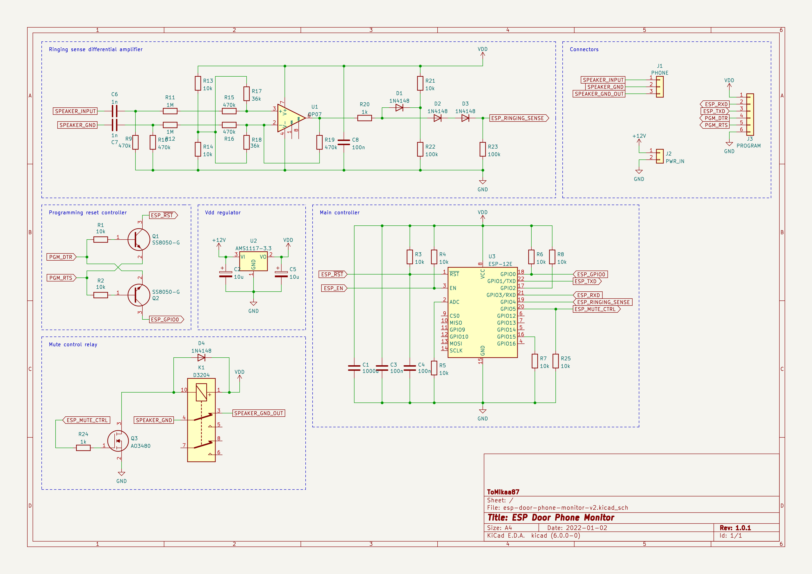
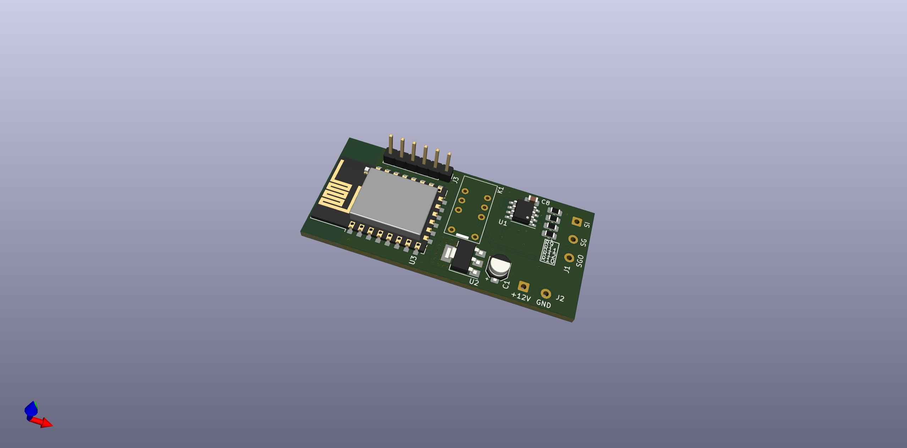
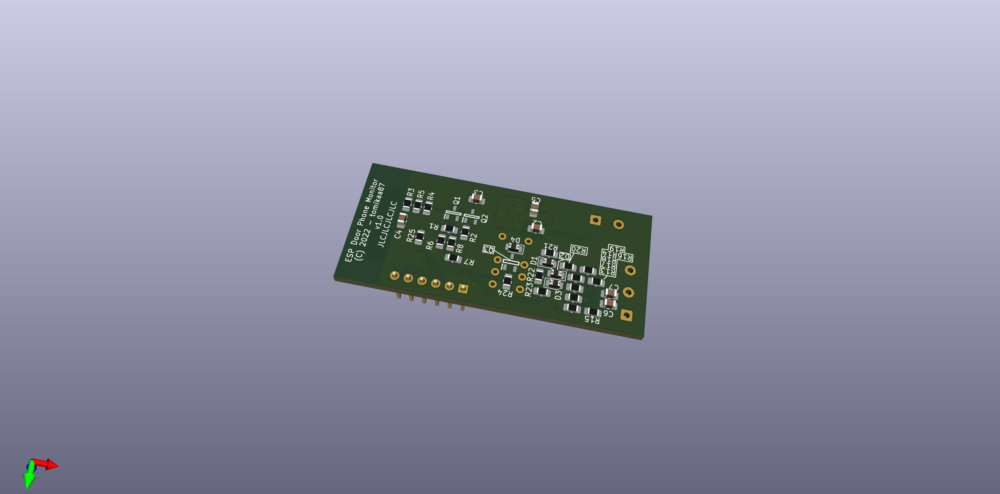

ESP Door Phone Monitor is an ESP8266-based device that monitors specific door phone types. It's able to check if the phone is ringing and also mute the ringer. The MQTT API makes it simple to integrate into various home automation systems, like Homebridge.

# Software

The ESP's firmware is based on Platform.io. It uses my own base library [esp-iot-base](https://github.com/tomikaa87/esp-iot-base) for fundamental functions like. OTA updates, MQTT and Blynk integration, remote logging etc. In its current state the software is pretty simple and does only the basics for ringing detection and mute functions. In the future I plan to improve it with automatic unmuting when it detects that the receiver has been picked after ringing to ensure that the user hears the person on the other side of the line.

# Schematics

The schematics are made in KiCad. The circuit has an OP07 op-amp in differential mode which senses the ringing signal. The differential mode and the AC-coupling ensures that the monitor can sense the signal and be protected even if there is a difference in potential of the device's ground and the door phone's speaker signal. (In my case there is 90V potential difference between the speaker signal and the power supply's ground.)

The controller is an ESP12F module with all the necessary support circuits (power supply, nodemcu-style reset circuit for programming). The differential amplifier drives an input pin which measures the frequency of the signal in an interrupt and determines if there is a ringer signal.

# PCB degisn

The PCB design is made in KiCad as well and mostly uses SMD parts.

